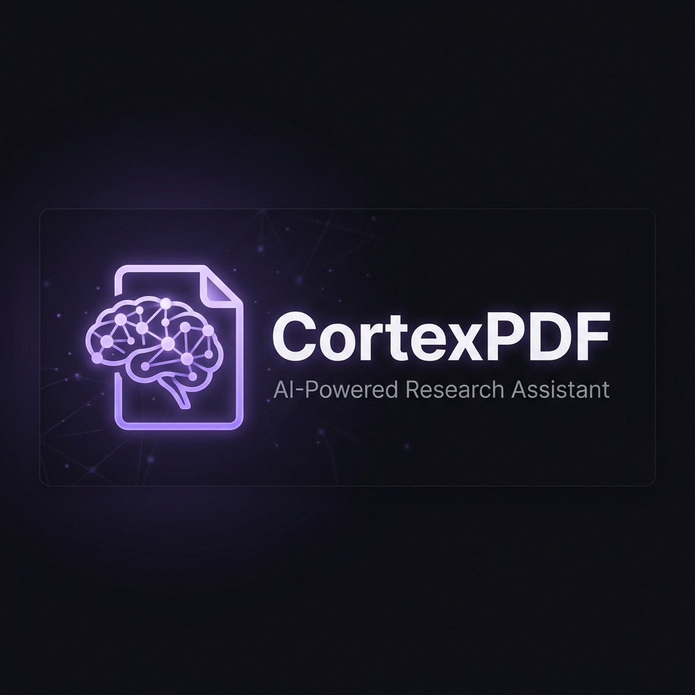

<div align="center">
  

  <h1>CortexPDF</h1>
  <p><strong>An AI-Powered Research Assistant & Viewport-Aware PDF Summarizer</strong></p>

  <p>
    <a href="#features">Features</a> •
    <a href="#supported-ai-providers">AI Providers</a> •
    <a href="#usage">Usage</a> •
    <a href="#security--privacy">Security</a>
  </p>
</div>

---

CortexPDF is a privacy-first, serverless web application that transforms how you read and analyze documents. It combines a high-performance PDF reader with an intelligent AI sidecar that generates contextual summaries, deep dives, and Markdown export—all working directly in your browser.

## ✨ Features

- **Split-Panel Workspace**: View your PDF on the left alongside a live, responsive AI summary panel on the right.
- **Local & Cloud AI Engines**: Connect directly to local models (like Ollama) for complete privacy, or use cloud APIs (Gemini, Claude, OpenAI, xAI) for advanced reasoning.
- **Serverless Architecture**: CortexPDF is a static site. No backend server is required. API keys and connections happen directly from your browser to the provider.
- **JSON & Markdown Sidecars**: Your research is never lost. Save and load your summary history using `.json` or `.md` sidecar files.
- **Material 3 Design**: A premium, responsive interface featuring dynamic layouts, smooth animations, and an immersive dark mode tailored for deep focus.
- **Multilingual Support**: Configure the AI to output summaries in one of 16 supported languages.

---

## 🧠 Supported AI Providers

CortexPDF connects directly from your browser to the following APIs:

| Provider | Setup Required | Privacy Level |
|----------|----------------|---------------|
| **Ollama** | Requires a running local instance (see below) | 🟢 Complete Privacy (Local) |
| **Google Gemini** | Requires API Key | 🟠 Cloud |
| **OpenAI** | Requires API Key | 🟠 Cloud |
| **Anthropic Claude** | Requires API Key (BYOK) | 🟠 Cloud |
| **xAI Grok** | Requires API Key | 🟠 Cloud |

### Using Ollama (Local AI)
To use local models like `llama3` via Ollama, you must configure your host machine to accept CORS requests from your browser.
Before starting the Ollama server, set the `OLLAMA_ORIGINS` environment variable:

**Windows (PowerShell):**
```powershell
$env:OLLAMA_ORIGINS="*"
ollama serve
```

**macOS/Linux:**
```bash
OLLAMA_ORIGINS="*" ollama serve
```

---

## 🚀 Usage

Since CortexPDF is a static application, you can run it immediately without complex dependencies.

### Option 1: Live Demo (GitHub Pages)
*(Link coming soon if hosted via GitHub Pages)*

### Option 2: Local Server
To run locally, simply serve the `Site/` directory using any local web server:

```bash
# Using Python
cd Site
python -m http.server 8000
```
Then navigate to `http://localhost:8000` in your browser.

---

## 📂 Project Structure

```text
CortexPDF/
├── Site/                    # The main static web application
│   ├── index.html           # Main application interface
│   ├── app.js               # Core UI and state logic
│   ├── ai-client.js         # AI provider integration and API logic
│   └── static/              # CSS, markdown renderer, and pdf.js assets
├── App/                     # (Legacy/Optional) Python backend tools
├── docs/                    # Documentation and assets
└── README.md
```

---

## 🔒 Security & Privacy

- **No Data Collection**: CortexPDF has no backend telemetry. Your PDFs are processed entirely in your browser using `pdf.js`.
- **Ephemeral Keys**: API keys for cloud providers are held in **volatile memory only**. They are never saved to `localStorage` or transmitted anywhere except directly to the official provider APIs. You must re-enter your key upon reloading the page.
- **Local Priority**: By using Ollama, your documents never leave your machine.

---

## 📜 License

This project is licensed under the MIT License - see the [LICENSE](LICENSE) file for details.
